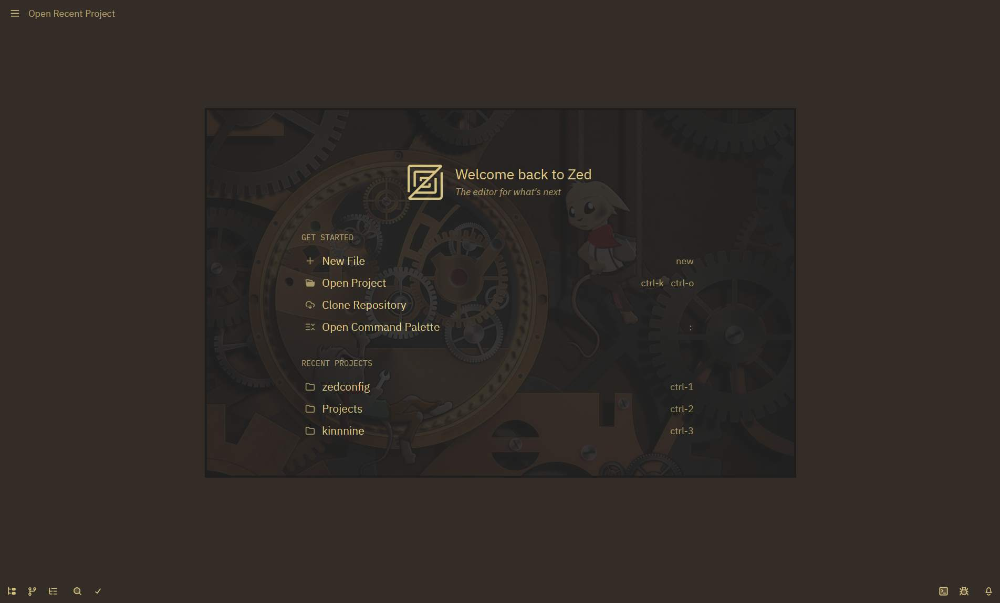
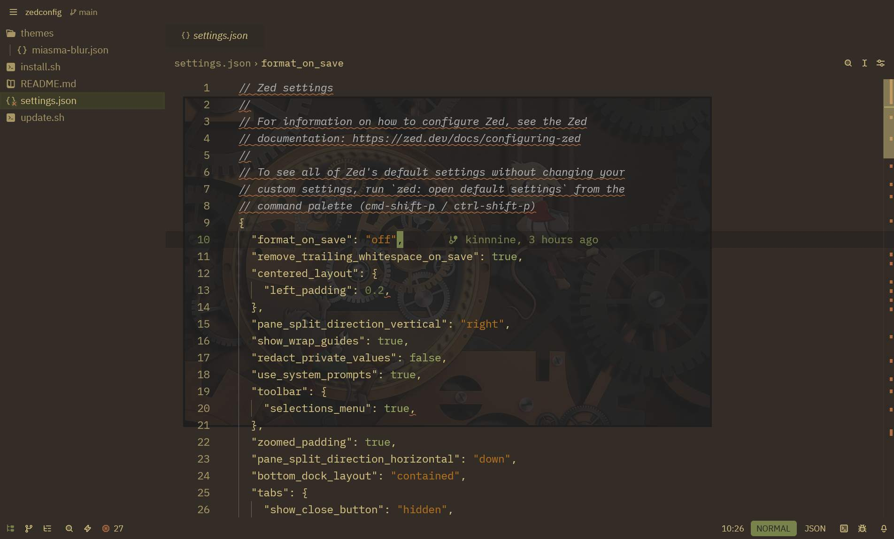
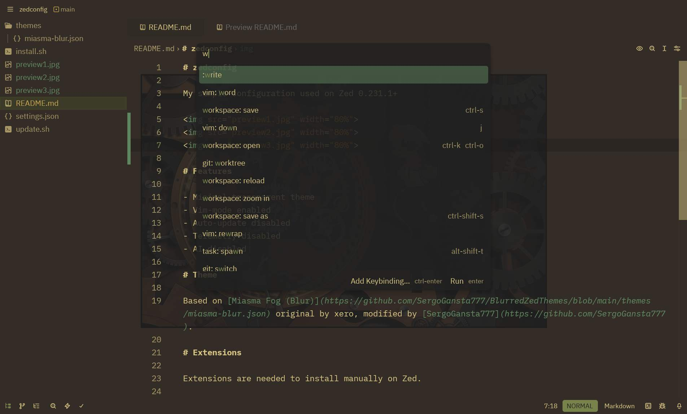

# zedconfig

My simple configuration used on Zed 0.231.1+

# Features

- Minimal transparent theme
- Vim-mode enabled
- Auto-update disabled
- Telemetry disabled
- AI disabled

# Theme

Based on [Miasma Fog (Blur)](https://github.com/SergoGansta777/BlurredZedThemes/blob/main/themes/miasma-blur.json) original by xero, modified by [SergoGansta777](https://github.com/SergoGansta777).

# Extensions

Extensions are needed to install manually on Zed.

- Vue
- HTML
- Basher
